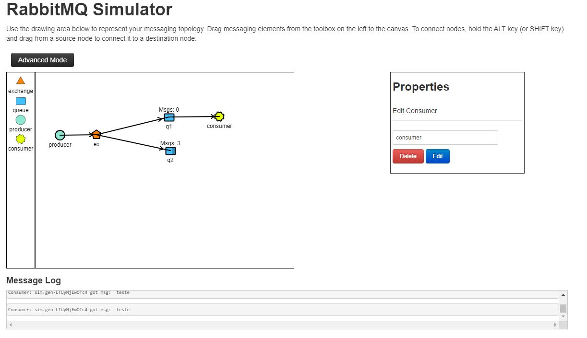

# Spring RabbitMQ Sample

This project is an example of how to publish and consume messages to a queue using RabbitMQ

## Requirements

Java 11+

IntelliJ IDEA / Netbeans / Eclipse

RabbitMQ

## Usage

```python

1) Execute the commands below: 

    1.1) docker-compose up -d
    1.2) docker exec rabbitmq rabbitmq-plugins enable rabbitmq_management
    1.3) docker exec rabbitmq rabbitmqctl add_user test test    
    1.4) docker exec rabbitmq rabbitmqctl set_user_tags test administrator
    1.5) docker exec rabbitmq rabbitmqctl set_permissions -p rabbitmq-host test ".*" ".*" ".*"

```

## Documentation

### [Simulator](http://tryrabbitmq.com/)



### Exchange Types

* **_Direct Exchange_** (Sends to those who have an informed route key)

    Producer -> Exchange -> Route Key (Bind) -> Queue -> Consumer


* **_Topic Exchange_** (Sends to the Queue that has the correct conditions X.*, *.Z, *.Y.*)

    Producer -> Exchange -> Route Key (Bind with conditions) -> Queue -> Consumer


* **_Fanout Exchange_** (Exchange sends to every Queue that is related)

    Producer -> Exchange -> Queue -> Consumer


Image Source: [Chi Thuc Nyugen- Medium](https://thucnc.medium.com/how-to-use-rabbitmq-4e53ad05cee2)

## Contributing
Pull requests are welcome. For major changes, please open an issue first to discuss what you would like to change.

Please make sure to update tests as appropriate.

## License
[MIT](https://choosealicense.com/licenses/mit/)